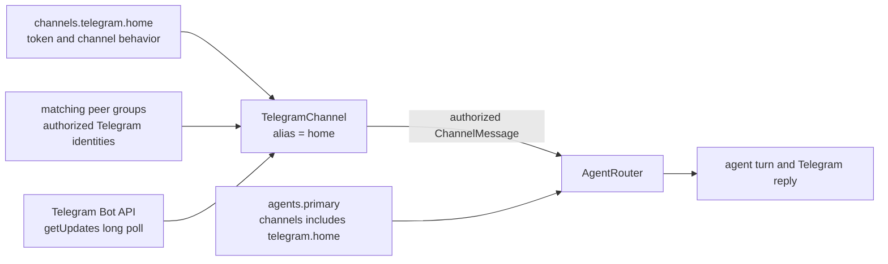
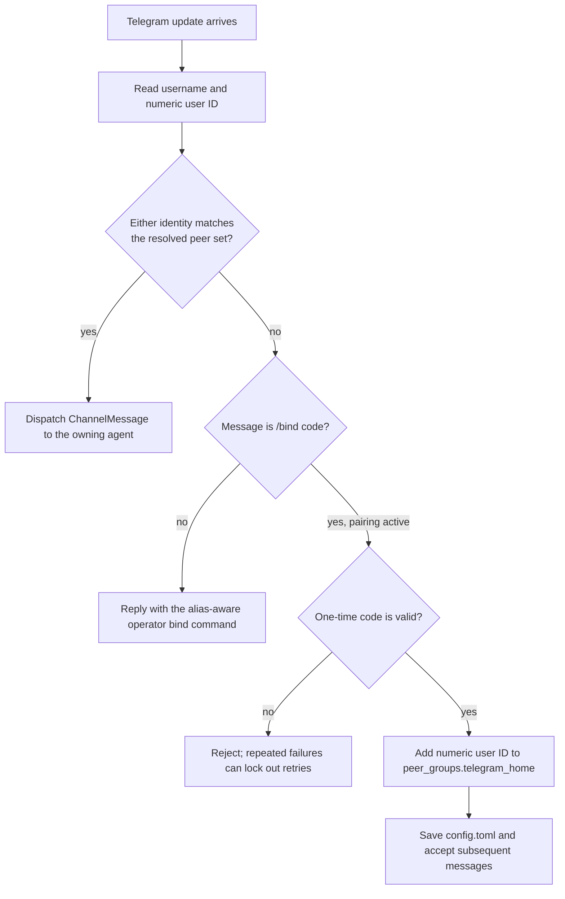

# Telegram

Run a ZeroClaw agent as a Telegram bot over long polling. No public URL or
webhook is required. This guide starts with the runtime wiring, then walks from
bot creation through the first authorized conversation.

## How the current implementation is wired

Telegram setup has three separate sources of truth. The channel block owns the
Telegram connection, the agent block owns routing, and peer groups own inbound
authorization:



`collect_configured_channels` constructs one `TelegramChannel` for every
enabled alias that an agent owns or that has a `routes` table (see
[Route one bot to several agents](#route-one-bot-to-several-agents)). The channel resolves matching peer-group members
from the shared `Config` when each message arrives. It accepts either the
sender's numeric Telegram user ID or username, then hands an authorized
`ChannelMessage` to the shared channel dispatch and agent-turn lifecycle.

There is no `allowed_users` field under `[channels.telegram.<alias>]`.
Authorization lives in [Peer Groups](./peer-groups.md); that page is the
canonical reference for peer-group fields, matching, and multi-agent behavior.

## 1. Create a Telegram bot

1. Open [@BotFather](https://t.me/BotFather) in Telegram.
2. Send `/newbot` and follow the prompts for a display name and username.
3. Copy the bot token. Telegram's
   [official tutorial](https://core.telegram.org/bots/tutorial#obtain-your-bot-token)
   covers the same flow.

Treat the token like a password. Anyone who has it can control the bot. Do not
paste it into `config.toml`, logs, screenshots, or source control.

## 2. Configure an alias and attach it to an agent

This guide uses `home` as the channel alias and `primary` as the agent alias.
The alias is ZeroClaw's local name for this bot instance; it does not have to
match the Telegram bot username.

Set the token through the masked secret prompt, then enable the channel:

```sh
zeroclaw config set channels.telegram.home.bot_token
zeroclaw config set channels.telegram.home.enabled true
```

List your agent aliases, then add `telegram.home` to the intended agent's
existing channel list. Omitting the value opens the list editor, so you can add
the new entry without discarding other channel bindings:

```sh
zeroclaw agents list
zeroclaw config set agents.primary.channels
```

Afterward, the relevant non-secret structure is equivalent to:

```toml
[channels.telegram.home]
enabled = true
# bot_token is stored encrypted after the masked `config set` prompt

[agents.primary]
channels = ["telegram.home"]
```

Replace `primary` with an existing agent that already has a working model
provider and risk profile. Once any agent in the config declares a `channels`
list, a channel that is enabled but not present in an enabled agent's
`channels` list is not started. If no agent declares any channel bindings,
ZeroClaw falls back to legacy routing instead: every enabled channel is
started and served by the resolved default enabled agent. Declare explicit
bindings as shown above so an unlisted bot is genuinely inactive rather than
silently running under the default agent.

## 3. Choose how the first users are authorized

Choose one of the following paths before starting the bot.

### Pair the first user with a one-time code

For a private first run, leave the resolved external-peer set empty. In
particular, no peer group whose `channel` is either `telegram` or
`telegram.home` may contribute any `external_peers` entries. A matching group
that carries only other settings while contributing no external peers does not
affect pairing.

When `TelegramChannel` is constructed with no resolved peers, it creates a
one-time pairing code and writes it to the foreground output and structured
logs. The first approved user redeems it from Telegram with `/bind`.

### Pre-authorize known users

If you already know the numeric Telegram user IDs, authorize them before
startup. A numeric ID is preferable to a username because it remains stable if
the user renames their account. This is the minimal alias-scoped example:

```toml
[peer_groups.telegram_home]
channel = "telegram.home"
external_peers = ["111111111", "222222222"]
```

Use a type-wide `channel = "telegram"` only when the same identities should be
accepted by every configured Telegram alias. For the complete schema and
resolution rules, see [Peer Groups](./peer-groups.md).

Any non-empty resolved external-peer set disables first-user pairing for that
channel instance. This includes a wildcard peer group.

> [!CAUTION]
> `external_peers = ["*"]` accepts every Telegram sender who can reach the bot
> and disables the one-time pairing flow. Those senders can drive the agent and
> any tools its risk profile permits. Use a wildcard only for a deliberately
> public bot with a suitably restricted agent; it is not a shortcut for private
> setup.

## 4. Start the channel and inspect it

Use the full daemon for normal operation, the channel-only process for a
foreground diagnostic run, or the installed service for long-running use:

```sh
zeroclaw daemon

# Alternative foreground diagnostic: starts all configured channels.
zeroclaw channel start

# If ZeroClaw is installed as a managed service.
zeroclaw service restart
```

Telegram uses `getUpdates` long polling, so it does not need an inbound port or
public callback URL. In another terminal, check connectivity and follow logs:

```sh
zeroclaw channel doctor
zeroclaw service logs --follow
```

With an empty peer set, look for `Telegram pairing required; one-time bind code
issued`. The structured event includes the channel alias and `pairing_code`.
Foreground `zeroclaw daemon` and `zeroclaw channel start` runs also print the
code directly. Treat the code and log output as sensitive until the code is
consumed.

## 5. Pair the first user with `/bind`

Send the printed code to the bot from the Telegram account you want to approve:

```text
/bind 123456
```

The authorization path is:



On success, ZeroClaw prefers the stable numeric sender ID, adds it to
`[peer_groups.telegram_home]` for `telegram.home`, and saves `config.toml`.
The running channel's peer resolver reads that shared config, so the user can
send the next message immediately without a restart.

The code is one-time. On later restarts the saved peer makes the resolved set
non-empty, so pairing stays disabled and no replacement code is issued. If the
bot says it paired only for the current runtime because persistence failed,
fix the reported config permission or write error before restarting.

## 6. Bind another user from the operator CLI

An unauthorized user can message the bot to receive a suggested operator
command containing their numeric ID. Run that command on the ZeroClaw host.
For the `home` alias it has this form:

```sh
zeroclaw channel bind-telegram 111111111 --alias home
```

You can also bind a Telegram username without its leading `@`:

```sh
zeroclaw channel bind-telegram example_user --alias home
```

`--alias` must match the key in `[channels.telegram.<alias>]`. The CLI defaults
to `default`, so only omit the flag when the configured channel really is
`[channels.telegram.default]`:

```sh
zeroclaw channel bind-telegram 111111111
```

The command rejects an unknown alias instead of creating a peer group that no
running channel would read. For a valid alias it creates or updates
`[peer_groups.telegram_<alias>]`, scopes the group to
`telegram.<alias>`, and saves the identity idempotently.

## Route one bot to several agents

A `routes` table lets one bot serve different chats with different agents,
for example two people's private chats and a shared group, each with its own
risk profile, tools, and memory. Routes use exact numeric Telegram IDs, never
usernames:

```toml
[channels.telegram.home]
enabled = true
per_user_session = false   # one shared session for the group; DMs unaffected

[channels.telegram.home.routes]
"111111111" = "owner"            # private chat with user 111111111
"222222222" = "partner"          # private chat with user 222222222
"-1001234567890" = "household"   # the group with this chat ID

[peer_groups.telegram_home]
channel = "telegram.home"
external_peers = ["111111111", "222222222"]
```

- A positive key routes the private chat whose chat ID and sender ID both
  equal it. A negative key routes the group or supergroup with exactly that
  chat ID, whoever in it is speaking.
- The runtime identifies a private one-to-one message from the normalized
  positive chat ID matching the sender's numeric Telegram ID. Group chats,
  forum-topic routes, and messages without that matching identity keep the
  reply-intent check.
- The peer allowlist still applies first. A chat without a route reaches no
  agent. There is no default or fallback agent.
- The table is the alias's only agent binding. Do not also list
  `telegram.home` in any `agents.<alias>.channels`.
- A routed alias is text-only. Photos, documents, albums, and voice notes are
  dropped before any download, and nothing is written to the channel's
  workspace directory. Text-to-speech replies are not bound on a routed alias.
- The `/model` picker does not open on a routed alias. `/model <hint>` still
  changes the model for the current session in the routed agent. In a group
  with `per_user_session = false`, that change applies to the whole group.

Config validation rejects a table that is empty, uses a key that is not a
canonical nonzero integer (`0123`, `+123`, or a username, for example), names
a missing or disabled agent, or sends a group to an agent that also has a
private-chat route on this alias. It also rejects a routed alias that appears
in any `agents.<alias>.channels`. `zeroclaw config` commands refuse to save
such a table. The daemon still boots with it, as it does for other validation
errors, but logs `invalid Telegram route table` and the alias reaches no
agent until you fix it.

Routes are read at startup. Session keys include the chat ID but not the
agent, so do not point an existing chat at a different agent and keep its
history. Stop the daemon, archive or delete that chat's session, change the
route, and restart.

Get the IDs from `getUpdates` while no ZeroClaw process is polling the token:
`message.from.id` in each private chat, and `message.chat.id` in the group.
Converting a group to a supergroup gives it a new `-100…` chat ID, and its
route stops matching until you update it.

## Invite friends and approve groups dynamically

Enable `invitations` to enroll people without editing routes or restarting.
Each invited private chat gets its own agent memory. Each approved group gets
one shared memory, separate from private chats and other groups. Existing
static routes take precedence and cannot be changed by enrollment commands.

Use an exact positive numeric owner ID, plus two enabled, unbound agent
templates. Templates must use private default workspaces, no cross-agent
memory grants or external bundles, and a risk profile allowing only memory
and optional `web_search_tool` tools. Full autonomy is rejected. Generated
agents cannot delegate to other agents.

```toml
[agents.guest_template]
model_provider = "openai.codex"
risk_profile = "guests"

[agents.group_template]
model_provider = "openai.codex"
risk_profile = "guests"

[risk_profiles.guests]
allowed_tools = ["memory_recall", "memory_store", "memory_forget"]
auto_approve = ["memory_recall", "memory_store"]

[channels.telegram.home]
enabled = true
bot_token = "<from your secret manager>"
per_user_session = false

[channels.telegram.home.invitations]
owner_id = "111111111"
guest_agent = "guest_template"
group_agent = "group_template"
```

Add a static owner route and owner peer group as in the previous section if
the owner should also chat with an existing owner agent. Do not attach this
Telegram alias through `agents.<alias>.channels`.

| Action | Where | Result |
|---|---|---|
| `/invite` | Owner's private chat | A single-use link valid for 24 hours |
| Open invite and press Start | Friend's private chat | Private enrollment; subsequent messages use their own memory |
| `/activate@your_bot` | Group, sent by the owner | All human group members can chat with the bot; memory belongs to this group |
| `/guests` | Owner's private chat | Active private and group chat IDs |
| `/revoke <chat-id>` | Owner's private chat | Blocks new requests from that private chat or group |

Keep BotFather's `/setjoingroups` enabled to add the bot to new groups.
Disable `/setprivacy` before adding it if ordinary group messages should reach
it. Groups stay closed until the owner sends `/activate`; a friend's private
invite grants no group access. Telegram sends the invite payload through
[`/start`](https://core.telegram.org/bots/features#deep-linking). Treat the
link as a temporary access credential: whoever redeems it first gets access.

Enrollment controls bypass the model. Edited, forwarded, anonymous-admin,
and bot-authored enrollment commands cannot grant access. Explicit peer deny
entries still apply. This mode is text-only, like static routed aliases.

Memberships and hashed invite tokens live in
`<data_dir>/telegram-memberships/<alias>.sqlite3`, outside the declarative
TOML. Back up the entire data directory, including memory and session state.
Re-rendering configuration or restarting preserves enrollment and memory.
Keep the channel alias stable: it is part of every generated agent identity.
Revocation preserves memory; a later invite or activation of the same chat
restores its identity. A turn already running when revoked may finish.

The store permits at most 512 active chats and 128 outstanding invites per
alias. Invalid templates or unavailable membership storage deny dynamic
access. If Telegram converts a group to a supergroup, activate the new chat
ID; it gets a new memory identity. Existing groups are not migrated implicitly.

## Restart and persistence behavior

| Change | When the running channel sees it |
|---|---|
| Successful `/bind <code>` in Telegram | Immediately; the channel updates the shared in-process config and saves it. |
| `zeroclaw channel bind-telegram ...` with a detected running systemd, OpenRC, or launchd service | The CLI saves the config and restarts the managed service automatically. |
| `bind-telegram` while `zeroclaw daemon` or `zeroclaw channel start` is running in another terminal | After you stop and restart that foreground process. The CLI process changed the file, not the other process's in-memory config. |
| Direct `config.toml` edit or standalone `zeroclaw config set` change | After a daemon reload or process restart. Saving alone does not rebuild long-running listeners. |
| Restart with no matching peers | A new one-time pairing code is generated. |
| Restart after a peer was saved | The peer remains authorized and startup pairing is not activated. |

If automatic reload fails, the bind command keeps the saved change and tells
you to restart manually:

```sh
zeroclaw service stop
zeroclaw service start
```

## Switching models from the chat (`/model`)

Authorized senders can switch the active model interactively, without leaving
Telegram.

- `/model` (no argument) opens an inline picker with provider categories and
  model options built from configured `[[model_routes]]`. Pages navigate via
  inline keyboard buttons; ✗ cancels.
- Selecting an option applies it to the **sender's session scope**, the same
  behavior as the text form `/model <hint>` on this sender. The picker never
  creates user- or agent-scoped overrides.
- Route hints that would collide with the command flag syntax (`--user`,
  `--agent`, or any `--flag`) are filtered out of the picker. The text
  command is not a fallback for them: `/model --user <hint>` and
  `/model --agent <hint>` are broader-scope commands, and any other
  leading `--flag` opens the help response. Rename or fix the hint in
  `config.toml` instead, and use `/model <hint>` only for hints that
  round-trip through the parser without being read as scope syntax.
  Unselectable options are also skipped when the provider or target no
  longer resolves, and so is a hint that an earlier route already claims
  (the same hint in a different case, or a hint equal to an earlier route's
  model identifier): `/model <hint>` would resolve to that earlier route
  first. Every route the picker leaves out is reported in the daemon log
  with its reason, so check the log when an expected option is missing.
- The text alternatives remain available: `/model <hint>` for a session-scoped
  route, `/model --user <hint>` / `/model --agent <hint>` for the broader
  scopes (if permitted), and `/models <provider>` to list models of a provider.

## Logs and troubleshooting

For an installed service:

```sh
zeroclaw service logs --lines 200
zeroclaw service logs --follow
```

For a foreground run, read the process output. When persistent structured
logging is enabled, events are also written under the install directory at
`data/state/runtime-trace.jsonl`; see [Observability](../ops/observability.md).

| Symptom | Cause and fix |
|---|---|
| `Telegram channel alias 'default' is not configured` | The channel uses another alias. Re-run the bind with the matching `--alias`, such as `--alias home`. |
| No pairing code appears | A matching peer group already resolves at least one peer, possibly `"*"`. Pairing is intentionally inactive; use the operator bind command or correct the peer group and restart. |
| The bot still asks for operator approval after `bind-telegram` | The running foreground process has not reloaded, or the identity was bound to the wrong alias. Restart it and verify the `--alias` value. |
| The bot is silent | Confirm `enabled = true`, confirm an enabled agent owns `telegram.<alias>`, run `zeroclaw channel doctor`, then inspect logs. |
| A routed alias ignores one chat | The chat has no exact route. The log says `dropping inbound message: no agent owns this channel`. Check the chat's numeric ID, and for a private chat that the sender's ID is the same number. |
| `Telegram polling conflict (409)` | More than one process is using the same bot token. Stop the duplicate daemon or channel process. |
| Group messages are ignored | With `mention_only = true`, mention the bot or reply directly to one of its messages. Direct messages are still processed. |
| Draft edits report `Too Many Requests` | Increase `channels.telegram.<alias>.draft_update_interval_ms` or disable streaming. |
| Teammates in one group or forum topic do not see each other's context | Group sessions are keyed per sender by default. Set `channels.telegram.<alias>.per_user_session = false` to share one session per chat (and per forum topic, when present). The shared session shares its controls: any member's `/new` resets the conversation for the whole group/topic, and a session-level `/model` override applies to every member, while `/stop` stays personal to each sender. Direct messages are unaffected. |

The full Telegram field list is generated from the live configuration schema:

{{#config-fields channels.telegram}}

## See also

- [Peer Groups](./peer-groups.md): canonical inbound authorization schema
- [Channel runtime lifecycle](../architecture/channel-runtime-lifecycle.md)
- [Service management](../setup/service.md)
- [Observability](../ops/observability.md)
